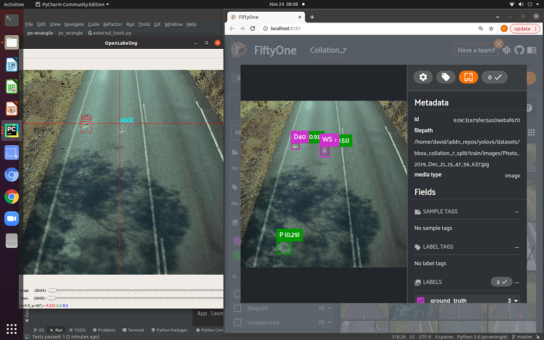

# `yo-laborate` 
_"helping computer vision engineers on a schedule"_

An app that facilitates MLOps specifically for YOLO datasets. Efficiently visualise, edit and wrangle images and labels with special support for maintaining sample subsets.



## Context and Purpose

Maintaining a dataset as a collection of independent subsets may be appropriate where there is some form of stratified sampling. For example, by geographical location, source camera/image quality/resolution, illumination conditions, or some other contextual grouping. Subgroups can be added as you bootstrap your dataset.  If model performance decreases after addition of any subset, the subset can easily be removed for a time in order to expedite training of a high performance model for a retricted context. `yo-wrangle` supports basic and advanced data wrangling with the option of maintaining subsets that can be selectively collated and split intro train-val sets.

`yo-wrangle` is particularly useful when working with the output from `Ultralytics/yolov5`, in a Debian (linux) environment.

The most compelling value of yo-wrangle is integration of `fiftyone` to shortlist likely errors in bootstrapped training data and `OpenLabeling` for editing. No need to check `N` images, just review and edit the "most mistaken" at the click of a button.

## Mission Statement / Capability Statement 

An app (with graphical interface) that is great to help you build a superior object detection training dataset. Yo-wrangle makes it easy to refine top-shelf training data by offering:

* “Dataset Improvement" actions trigger opening of OpenLabeling and a FiftyOne interface simultaneously, loading them both with the the same short list of images that a most likely to contain labeling errors. 
* See the ground truth vs predictions in a high powered data exploration app whilst editing your annotations in another dedicated labelling app. 
* No more churning through copy-paste-search-open-edit-save sequences repeatedly for each and every image. 

Also, `yo-wrangle` provides dataset wrangling and bootstrapping basics, featuring:
* Wrangling tools that allow you to conserve precious NVM SSD space by sampling original images based on a cleansed directory of cropped image detections. 
* Options to uniformly subsample, filter according to confidence, restrict to certain classes/subfolders and amalgamate/recode class ids. 
* “Improve Dataset” action uses FiftyOne to find likely errors in old training data - no need to check `N` images. Just check the worst 20 say.  
* “Grow Dataset” action uses FiftyOne to mine for “hard” and unique training images. 
* Fewer “high value” training images leads to a compact dataset that performs well and is quicker to train. 
* Bootstrap a COCO dataset for segmentation modelling by converting bounding boxes to segmentation polygons.

## System Requirements

To fully utilise this library, you will need to be using the Linux OS (tested on Ubuntu 20.04) and a GPU.

Wrangling scripts will work fine on Windows 10, however, `init_fiftyone_dataset` and `find_errors` will not work.
It would be great to get these working on Windows, however, I ran into trouble with running evaluations via `fiftyone-brain`. 
The problem may have been lack of a gpu, but surely it should gracefully fall back to using the CPU.

Contributors are encouraged to contact me if you think you can solve this problem!

Other important requirements include:
* NauchtanRobotics/OpenLabeling repository installed
* Ultralytics/yolov5 repository installed

The NauchtanRobotics fork of OpenLabeling has been modified to accept a list of images which can be in different folders.

## Installation

Open a linux terminal (or git bash) and complete the following steps:

1. Install python-poetry then reboot. See https://python-poetry.org/docs/#installation
2. Clone this repository:  `git clone git@github.com:NauchtanRobotics/yo-wrangle.git`
3. Change working directory to newly cloned repo: `cd yo-wrangle` (n.b. you can rename this folder to describe your dataset, e.g. `number_plates_dataset`)
4. Create virtual environment:  `poetry install` See https://python-poetry.org/docs/basic-usage/#installing-dependencies
5. `cd ~ && git clone git@github.com:NauchtanRobotics/OpenLabeling.git`
6. `cd ~ && git clone git@github.com:NauchtanRobotics/yolov5.git`

For finding possible annotation errors with the help of `fiftyone-brain`, you will need pytorch python based libraries installed.
To install python `torch` and `torchvision`, follow instructions at https://pytorch.org/get-started/locally/

Installation of torch libraries will depend on the needs of your system. Having an RTX3090, I found
it best not to install CUDA / cuDNN on my system, but rather install python packages which contain
the necessary drivers for RTX3090, e.g. activate the poetry virtual env then run command in bash
```
pip3 install torch==1.10.0+cu113 torchvision==0.11.1+cu113 -f https://download.pytorch.org/whl/cu113/torch_stable.html
```

### Troubleshooting tips for Linux Platform

* You need to reboot once between installing poetry and running `poetry install`
* I installed a package by lambda labs to help with driver dependencies for the GPU, but this may not be necessary. 
* To check GPU drivers are installed `sudo lshw -C display` or `hwinfo --gfxcard --short`
* Check you have tools for troubleshooting GPU operation by running this command `watch nvidia-smi`

## Getting Started
### Configuration
1. Make a copy of `config.example.ini` and name it `config.ini`.
2. Edit the paths in `config.ini` to line up with your system.
3. Add your dataset (subsets) folders to the root directory
4. Create a file called `subsets_excluded.txt` and add one folder name per line if you want any folders excluded.
5. Create a copy of `wrangling_example.py` and call it `dataset_workbook.py` 
6. Edit any parameters in `dataset_workbook.py` including setting your version.
7. Run the wrangling scripts in `wrangling_example`
8. Commit your work `git add . && git commit -m 'v1.0'`

You should retrain your model and commit your work in small increments. 
If model performance, you can easily back track and branch off at an earlier save-point.
Small increments allow you to analyse a series of 'experiments' to ratchet up the performance of your model.

## Contributing

### In-Scope
* TODO: pytest unit tests
* TODO: GUI interface with poetry defined entry point.
* TODO: Poetry packaging / creation of a python wheel.
* TODO: Continuous Integration scripts to run tests on github.

### Out-of-Scope
* ? open to discussion
* Web interface would be lovely, but there are no full-time developers on this project - a little out of reach unless someone good at React is confident in integrating makesense..
* The app is not intended to be all things to all computer vision engineers. Be guided by the Context and Purpose, and Mission Statement.
